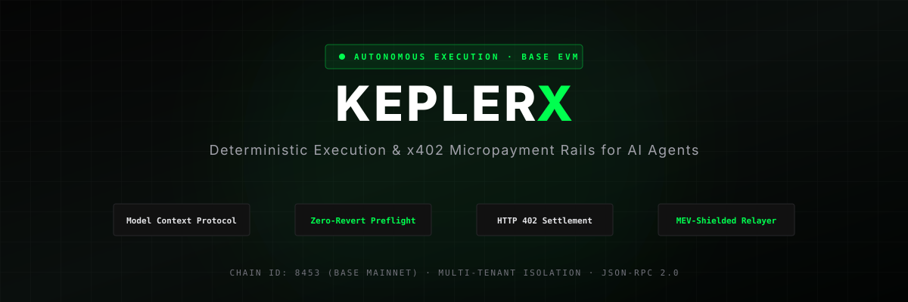

<p align="center">
  
</p>

<p align="center">
  <strong>Autonomous Execution &amp; x402 Settlement Gateway on Base</strong>
</p>

<p align="center">
  <a href="https://base.org"></a>
  <a href="https://spec.modelcontextprotocol.io"></a>
  <a href="https://www.typescriptlang.org"></a>
  <a href="https://viem.sh"></a>
  <a href="./LICENSE"></a>
</p>

---

## Overview

**KeplerX** bridges autonomous reasoning agents (Claude, Gemini, ElizaOS, Daydreams, AutoGen, LangChain) with deterministic on-chain execution on the **Base (EVM)** blockchain.

While AI reasoning processes are probabilistic, financial value transfer on-chain requires mathematical determinism. KeplerX enforces this bridge through three core layers:

1. **Model Context Protocol (MCP) Gateway**: Standardized JSON-RPC 2.0 endpoints allowing any autonomous agent or agentic tool runner to invoke verified blockchain operations.
2. **Deterministic Preflight RPC Guard (`simulate: true`)**: Dry-runs every intended transaction against live Base state using `eth_estimateGas` and `eth_call`. Flawed calls are intercepted before broadcast, preventing lost gas capital.
3. **HTTP 402 Settlement Rails**: Standardized cryptographic micropayment verification over HTTP status code `402 Payment Required`, enabling pay-per-call autonomous resource consumption using Base native USDC.

---

## Core Architecture

```
┌─────────────────────────────────────────────────────────────┐
│                    Autonomous AI Agent                      │
│            (Claude / Cursor / ElizaOS / Python)             │
└──────────────────────────────┬──────────────────────────────┘
                               │
            JSON-RPC 2.0 (MCP) │ HTTP / SSE
                               ▼
┌─────────────────────────────────────────────────────────────┐
│                 KeplerX Protocol Gateway                    │
│   ┌───────────────────────────┬─────────────────────────┐   │
│   │ Multi-Tenant Isolation    │ 256-bit CSPRNG Sessions │   │
│   ├───────────────────────────┼─────────────────────────┤   │
│   │ x402 Micropayment Auth    │ Base USDC Micropayments │   │
│   ├───────────────────────────┼─────────────────────────┤   │
│   │ Preflight RPC Guard       │ Zero-Gas Revert Shield  │   │
│   ├───────────────────────────┼─────────────────────────┤   │
│   │ Semantic Revert Decoder   │ Context Adaptation      │   │
│   └───────────────────────────┴─────────────────────────┘   │
└──────────────────────────────┬──────────────────────────────┘
                               │
             Signed Raw TX / Direct RPC
                               ▼
┌─────────────────────────────────────────────────────────────┐
│                   Base Blockchain (EVM)                     │
│    Aerodrome Router · Aave V3 Pool · Base Native USDC       │
└─────────────────────────────────────────────────────────────┘
```

---

## Key Capabilities

- **Zero Fake Hashes / 100% Real Execution**: All calls interact with genuine Base node RPCs. Transactions are either executed directly through connected browser accounts or broadcast autonomously with genuine gas validation.
- **Preflight Gas Preservation**: If an agent generates an order with expired slippage or insufficient collateral, the KeplerX guard catches the revert on the RPC layer, spending **0 gas**.
- **Semantic Revert Decoder**: Translates 4-byte EVM errors into actionable explanations returned to agent memory.
- **Multi-Tenant Session Isolation**: Independent memory sandboxes, separated cryptographic keypairs, and anti-collision guarantees. User sessions cannot collide or tamper with one another.

---

## Verified Smart Contracts on Base

| Protocol / Asset | Network | Contract Address |
|---|---|---|
| **Base Native USDC** | Base Mainnet (8453) | `0x833589fCD6eDb6E08f4c7C32D4f71b54bdA02913` |
| **Aerodrome Router V2** | Base Mainnet (8453) | `0xcF77a3Ba9A5CA399B7c97c74d54e5b1Beb874E43` |
| **Aave V3 Pool Contract** | Base Mainnet (8453) | `0xA238Dd80C259a72e81d7e4664a9801593F98d1c5` |
| **Base Sepolia USDC** | Base Sepolia (84532) | `0x036CbD53842c5426634e7929541eC2318f3dCF7e` |

---

## Installation & Setup

### 1. Clone the Repository
```bash
git clone https://github.com/sandman-sh/KeplerX.git
cd KeplerX
```

### 2. Install Dependencies
```bash
npm install
```

### 3. Configure Environment Variables
Create your local environment file:
```bash
cp .env.example .env
```

Your `.env` file structure:
```bash
# Protocol & Network
VITE_PROJECT_NAME=KeplerX
VITE_APP_VERSION=1.0.0
VITE_DEFAULT_NETWORK=8453

# Live Base RPC Endpoints
VITE_BASE_MAINNET_RPC=https://mainnet.base.org
VITE_BASE_SEPOLIA_RPC=https://sepolia.base.org

# KeplerX Autonomous Relayer & Agent Identity (Optional)
VITE_AGENT_PRIVATE_KEY=0x_your_private_key_here_or_leave_blank

# x402 Micropayment Dispatcher Receiver Address
VITE_DISPATCHER_RECEIVER=0x742d35Cc6634C0532925a3b844Bc454e4438f44e
```

### 4. Start the Application & MCP Server
```bash
npm run dev
```
The server starts locally at `http://localhost:3000` with the MCP endpoint live at `http://localhost:3000/api/mcp`.

---

## Model Context Protocol (MCP) Integration

Any AI tool runner or agent can connect to KeplerX over standard HTTP JSON-RPC 2.0.

### 1. Claude Desktop Configuration
Add the following to your `claude_desktop_config.json`:
```json
{
  "mcpServers": {
    "keplerx": {
      "command": "npx",
      "args": [
        "-y",
        "@modelcontextprotocol/server-fetch",
        "http://localhost:3000/api/mcp?token=YOUR_SESSION_TOKEN"
      ]
    }
  }
}
```

### 2. Cursor IDE Configuration
Add to `.cursor/mcp.json`:
```json
{
  "mcpServers": {
    "keplerx": {
      "url": "http://localhost:3000/api/mcp?token=YOUR_SESSION_TOKEN"
    }
  }
}
```

### 3. Python Integration (LangChain / CrewAI / Requests)
```python
import httpx

url = "http://localhost:3000/api/mcp"
headers = {"Authorization": "Bearer YOUR_SESSION_TOKEN"}

# Execute live on-chain preflight simulation
payload = {
    "jsonrpc": "2.0",
    "id": 1,
    "method": "tools/call",
    "params": {
        "name": "keplerx_preflight_simulate",
        "arguments": {
            "intent": "Swap 500 USDC for WETH on Aerodrome",
            "targetContract": "0xcF77a3Ba9A5CA399B7c97c74d54e5b1Beb874E43",
            "calldata": "0x38ed1739",
            "network": "8453"
        }
    }
}

response = httpx.post(url, headers=headers, json=payload)
print(response.json())
```

---

## MCP Tools Reference

| Tool Name | Parameters | Description |
|---|---|---|
| `keplerx_get_telemetry` | `{"network": "8453" \| "84532"}` | Returns block height, gas price in Gwei, active relayer count, and RPC health. |
| `keplerx_preflight_simulate` | `{"intent": str, "targetContract": str, "calldata": str, "network": str}` | Performs a live dry-run on Base nodes via `eth_estimateGas` and `eth_call`. |
| `keplerx_create_x402_auth` | `{"intent": str, "network": str}` | Creates an HTTP 402 payment auth requirement for micro-settlement. |
| `keplerx_execute_dispatch` | `{"intent": str, "protocol": str, "targetContract": str, "calldata": str}` | Submits transaction to Base network with MEV shield routing. |
| `keplerx_get_audit_trail` | `{"limit": int}` | Retrieves cryptographic ledger of executed actions. |

*(Legacy `keeperhub_*` tool prefixes are fully supported as aliases).*

---

## Verification & Testing

Run the end-to-end automated verification script:
```bash
node test-e2e.js
```

Build the production bundle:
```bash
npm run build
```

---

## License

This project is licensed under the MIT License — see the [LICENSE](./LICENSE) file for details.
